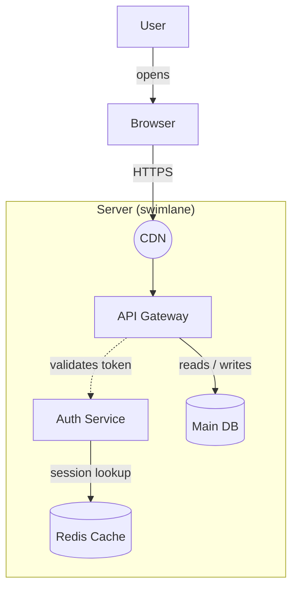

# Understand a draw.io diagram

You are explaining a diagram to someone who may have never opened draw.io and may be new to system design. The goal is not to describe XML — it is to make the system the diagram depicts feel obvious. Everything you produce should read like a friendly senior engineer walking a new teammate through a whiteboard sketch.

## Inputs you might receive

1. **`.drawio` / `.xml` file** — XML (sometimes base64+deflate compressed inside a `<diagram>` tag). Best input: exact, complete.
2. **`.svg` exported from draw.io** — usually embeds the full diagram XML in a `content="..."` attribute. Try extracting that before falling back to visual reading.
3. **Image (PNG, screenshot, photo of a whiteboard)** — no XML; you read it visually with the Read tool.

## Workflow

### Step 1 — Extract the structure

For a `.drawio`, `.xml`, or `.svg` file, run the bundled script rather than eyeballing XML. It decodes compressed content, resolves IDs to labels, classifies shapes, and flags dangling edges and orphan nodes:

```bash
python <skill-dir>/scripts/drawio_inventory.py <file> --pretty
```

Read the JSON output. If the script reports the SVG has no embedded `content=` attribute, or the file is an image, go visual instead: Read the image directly. Before writing anything, extract from the image — deliberately, one pass — every distinct piece of the drawing:

- **every labeled element** (boxes, cylinders, diamonds, icons, stick figures) and its shape
- **every line**: endpoints, arrowhead direction(s) or absence, solid vs dashed, color, and any label text on it
- **boundary/grouping boxes**: dashed or shaded regions, swimlane headers, and exactly what sits inside each
- **color coding and legends**: a legend box overrides your default interpretations; without one, note color patterns as inferred

Images lack the ground truth XML gives you, so these extractions are where visual runs go wrong — transcribing a label or missing an arrowhead silently corrupts the whole map. When a label is unreadable, say so rather than guessing.

Multi-page files return one entry per page. Explain every page, but lead with the one the user seems to care about (or the first non-empty one).

### Step 2 — Verify visually (XML inputs only, when cheap)

XML tells you *what* connects to what, but a quick look at a rendering catches things XML hides: crossing edges, overlapping nodes, layout intent (left-to-right vs top-down), color coding the style strings only hint at. If an image rendering was provided alongside the XML, look at it. Don't try to render the file yourself unless the user asks.

### Step 3 — Interpret semantics

Map shapes and line styles to what they *mean*. The full mapping lives in `references/shape-semantics.md` — read it when you encounter a shape or arrow style you're not sure how to phrase. The essentials:

- **Shape = role**: cylinder → database/data store, rhombus/diamond → decision, actor stick-figure → person/user role, rounded box → process/service, ellipse → often a start/end or a node, cloud → internet/external network, rectangle in a swimlane → a step by that actor.
- **Line style = relationship**: arrow → flow/dependency direction, dashed → often optional/async/indirect, no arrowheads → association or bidirectional, diamond → UML aggregation/composition.
- **Boundaries = grouping**: swimlanes → actors or responsibility areas ("everything in this lane is done by X"), groups/containers → subsystems, deployment boundaries ("everything inside this box runs in the VPC"), or phases.

Judge intent from context: a dashed line in one diagram means "async call", in another "planned/optional component". If labels or a legend say what a style means, the legend wins. When a style's meaning is genuinely ambiguous, say so rather than guessing confidently — note it under "Assumptions & open questions".

### Step 4 — Write the Markdown system map

Produce a single Markdown document with exactly these sections (rename the title to describe the actual system):

```markdown
# System Map: <Diagram Name>

## What this diagram shows
2–4 plain sentences. What the system does, who uses it, and what the big picture is.
No jargon yet — write this so someone's manager understands it.

## The pieces (nodes)
A table: | Component | Type | What it is / does |
Group by boundary/swimlane if present. "Type" uses friendly words —
"Database", "Decision point", "External service", "User" — not draw.io style names.

## The boundaries
One bullet per swimlane/group/container: what it contains and what it represents
(an actor's responsibilities, a network zone, a deployment environment...).
If there are none, write "This diagram has no boundary boxes — everything sits on one canvas."

## How it flows (edges)
A table of connections: | From | To | Connection | Meaning |
"Meaning" translates: "dashed arrow, labeled 'validates token'" → "API asks Auth to
validate tokens before proceeding".

Then a **step-by-step walkthrough** — the heart of the document. Follow the edges
from the entry point (usually an actor, client, or start node) and narrate the
journey in numbered steps, one sentence each. Plain language:
1. A user opens the app in their browser.
2. The browser sends HTTPS requests through the CDN, which ...

## Diagram at a glance
A Mermaid flowchart recreating the diagram's logic (see below).

## Observations & tips
- Anything noteworthy for a draw.io beginner or a design reviewer: cycles/loops,
  single points of failure, orphan nodes, missing labels, inconsistent arrow usage.
- One or two gentle draw.io tips when relevant (e.g. "the unlabeled edge from CDN
  to API Gateway — labeling edges is the #1 thing that makes diagrams readable").

## Assumptions & open questions
Where you interpreted an ambiguous style, or things the diagram doesn't say.
```

Adapt the structure with judgment — a 3-node diagram doesn't need every table; a BPMN process with 5 lanes does. Never drop "What this diagram shows" or the walkthrough; those are what a beginner actually needs.

### The Mermaid recreation

Give the reader a mental model they can re-render and edit themselves. Use semantic shape names so it stays readable:



Conventions: `[( )]` cylinders for data stores, `{ }` diamonds for decisions, `(( ))` circles for endpoints/edge nodes, `subgraph` for swimlanes/containers, `-.->` for dashed lines. Match the original's direction (TD/LR) so it *looks* like the source. Only include structure that exists — don't invent nodes to "fix" the design.

## Writing style

- Plain words first: "data store" before "persistence layer", "asks" before "invokes".
- Name nodes exactly as labeled (with IDs only when two nodes share a label).
- The script's `warnings` (dangling edges, orphan nodes) usually become "Observations" — they're diagram-quality signals, not parsing errors to hide.
- Keep tables scannable; put nuance in the walkthrough prose.
- Beginner glossary only when a real concept needs it (e.g. first time you say "swimlane", add "(a labeled column/row grouping everything one actor does)").

## References

- `references/shape-semantics.md` — shape, arrow, and style-to-meaning tables (read when interpreting unusual styles, UML, BPMN, ERD, or cloud icon libraries like `mxgraph.aws4.*`).
